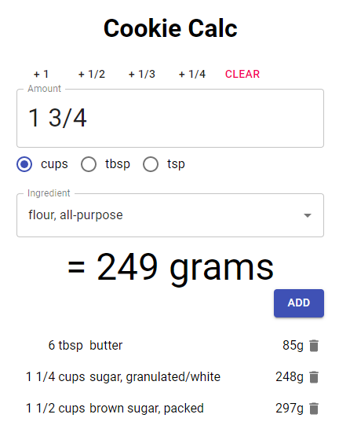

This is a simple calculator for converting ingredients from US/Imperial volumetric measurements to grams. I needed something that would be simple and easy to use from my phone while baking, when my hands are covered in flour and butter.

It uses:

- [TypeScript](https://www.typescriptlang.org/)
- [Next.js](https://nextjs.org/)
- [Material-UI](https://material-ui.com/)

This app is hosted by [Vercel](vercel.com) at:

- https://cookiecalc.vercel.app

